```mermaid
graph TB
  Server[🖥️ Serveur Central<br/>SVN/CVS]
  Client1[💻 Client 1]
  Client2[💻 Client 2]
  Client3[💻 Client 3]
  
  Server -->|checkout| Client1
  Server -->|checkout| Client2
  Server -->|checkout| Client3
  Client1 -->|commit| Server
  Client2 -->|commit| Server
  Client3 -->|commit| Server
  
  style Server fill:#8b1e1e
  style Client1 fill:#004a45
  style Client2 fill:#004a45
  style Client3 fill:#004a45
```

```mermaid
graph TB
    Remote[📦 Remote]
    Dev1[💻 Dev 1]
    Dev2[💻 Dev 2]
    Dev3[💻 Dev 3]
    
    Remote <-->|push/pull| Dev1
    Remote <-->|push/pull| Dev2
    Remote <-->|push/pull| Dev3
    Dev1 -.-> Dev2
    Dev2 -.-> Dev3
    
    style Remote fill:#8b1e1e
    style Dev1 fill:#004a45
    style Dev2 fill:#004a45
    style Dev3 fill:#004a45
```

```mermaid
graph TD
    Commit[💾 Commit<br/>abc123]
    Tree[📁 Tree<br/>def456]
    Blob1[📄 Blob<br/>ghi789<br/>app.js]
    Blob2[📄 Blob<br/>jkl012<br/>style.css]
    
    Commit -->|pointe vers| Tree
    Tree -->|contient| Blob1
    Tree -->|contient| Blob2
    
    style Commit fill:#3b82f6,color:#fff
    style Tree fill:#14b8a6,color:#fff
    style Blob1 fill:#a855f7,color:#fff
    style Blob2 fill:#a855f7,color:#fff
```

# 📜 Rappel historique

  <v-click>
    

      D'où vient Git ?
    

  </v-click>
  
  <v-click>
    

      Pourquoi a-t-il révolutionné le développement ?
    

  </v-click>
  
  <v-click>
    

      Comment fonctionne-t-il <strong>vraiment</strong> ?
    

  </v-click>

  Retour aux fondations pour mieux comprendre

<!--
Note orale:
- Transition depuis l'introduction
- Annoncer qu'on va revenir aux bases
- Créer de l'intérêt pour la suite
-->

---
layout: two-cols-header
class: text-center
---

# L'ère centralisée : SVN / CVS

<h2 class="mb-12">Avant Git</h2>

::left::

  <ul>
    <li v-click="2">
      <strong>Serveur unique</strong> (SPOF - Single Point of Failure)
    </li>
    <li v-click="3">
      <strong>Dépendance au réseau</strong> pour chaque opération
    </li>
    <li v-click="4">
      <strong>Pas de sauvegarde locale</strong> complète
    </li>
    <li v-click="5" class="mt-4">
      <strong>Problème</strong> : Si le serveur tombe, tout s'arrête
    </li>
  </ul>

::right::

<v-click at="1">

</v-click>

<!--
Note orale:
- Expliquer le problème du SPOF
- Montrer la dépendance au réseau
- Transition vers la solution distribuée
-->

---
layout: default
class: text-center
---

# Linus Torvalds et la Puissance du Distribué

  <v-click>
    

      
Nécessité pour le noyau Linux

      
Des milliers de contributeurs, besoin de performance

    

  </v-click>
  
  <v-click>
    

      
Concept révolutionnaire

      
Chaque clone est une <strong>sauvegarde complète</strong>

    

  </v-click>
  
  <v-click>
    

      
Avantages

      

        - Travail hors ligne 
        - Pas de serveur central 
        - Performance locale
      

    

  </v-click>

<!--
Note orale:
- Raconter brièvement l'histoire de la création de Git
- Insister sur le concept distribué
- Montrer les avantages pratiques
-->

---
layout: two-cols-header
class: text-center
---

# Le Modèle Distribué de Git

::left::

  <v-click>
    

      
📦 Chaque clone est complet

      
Historique entier du projet

    

  </v-click>
  
  <v-click>
    

      
✅ Pas de SPOF

      
Si le serveur tombe, on continue

    

  </v-click>
  
  <v-click>
    

      
🔄 Échanges flexibles

      
Push/pull avec remote ou entre devs

    

  </v-click>
  
  <v-click>
    

      
⚡ Travail hors ligne

      
Commits, branches, merge localement

    

  </v-click>

::right::

<v-click>

</v-click>

<!--
Note orale:
- Montrer la différence avec le modèle centralisé
- Insister sur le fait que chaque clone est complet
- Expliquer qu'on peut travailler sans serveur central
- Mentionner les échanges directs possibles entre développeurs
-->

---
layout: two-cols-header
class: text-center
---

# Git stocke des Snapshots, pas des Deltas

<h3 class="opacity-80 mb-4">Comprendre le modèle de stockage de Git</h3>

::left::

  <v-click>
    
⌠SVN : Modèle Delta

    

      

        
Version initiale :

        <code class="text-xs">File.txt (contenu complet)</code>
      

      

        
Version 2 :

        <code class="text-xs">+ ligne 5: "nouveau code"</code>
      

      

        
Version 3 :

        <code class="text-xs">- ligne 3 | + ligne 8</code>
      

      

        
⚠️ Problème :

        
Rejouer toutes les modifications depuis v1

      

    

  </v-click>

::right::

  <v-click>
    
✅ Git : Modèle Snapshot

    

      

        
Commit 1 (abc123) :

        <code class="text-xs">File.txt (v1 complète)</code>
      

      

        
Commit 2 (def456) :

        <code class="text-xs">File.txt (v2 complète)</code>
      

      

        
Commit 3 (ghi789) :

        <code class="text-xs">File.txt (v3 complète)</code>
      

      

        
✨ Avantage :

        
Accès instantané sans reconstruction

      

    

  </v-click>

<v-click>

  
💡 En réalité : Git optimise avec la compression

  

    Git utilise des <strong>pack files</strong> pour compresser et dédupliquer les données identiques. 
    Le modèle conceptuel reste un snapshot, mais le stockage est optimisé !
  

</v-click>

<!--
Note orale:
- SVN stocke la version initiale puis les différences (deltas)
- Git prend un "snapshot" complet à chaque commit
- Accès direct à n'importe quelle version sans reconstruction
- Git optimise en arrière-plan avec la compression (pack files)
- C'est pourquoi Git est si rapide pour les opérations locales
-->

---
layout: two-cols-header
---

# Sous le capot : Blob, Tree, Commit

<h3 class="opacity-80 mb-2">Les 3 objets fondamentaux de Git</h3>

::left::

  <v-click>
    

      
📄 Blob (Binary Large Object)

      

        
• Stocke le <strong>contenu d'un fichier</strong>

        
• Compressé avec zlib

        
• Identifié par SHA-1 du contenu

        

          <code>git hash-object fichier.txt</code>
        

      

    

  </v-click>
  
  <v-click>
    

      
📠Tree (Arbre)

      

        
• Représente un <strong>répertoire</strong>

        
• Liste des fichiers et sous-dossiers

        
• Référence les Blobs et autres Trees

        

          Comme un <code>ls -l</code> versionné
        

      

    

  </v-click>
  
  <v-click>
    

      
💾 Commit (Snapshot)

      

        
• Pointe vers un <strong>Tree racine</strong>

        
• Métadonnées : auteur, date, message

        
• Référence au(x) commit(s) parent(s)

        

          C'est le "snapshot" du projet
        

      

    

  </v-click>

::right::

<v-click>

</v-click>

<v-click>

  
🔑 Principe clé :

  
Chaque objet est immuable et identifié par son SHA-1. Si le contenu change, le hash change !

</v-click>

<!--
Note orale:
- Blob : contenu pur du fichier, pas de nom ni métadonnées
- Tree : comme un répertoire, lie noms de fichiers et blobs
- Commit : snapshot complet avec historique (parent)
- Tous immuables : si on change 1 caractère, nouveau SHA-1
- C'est ce modèle qui rend Git si puissant et fiable
-->

