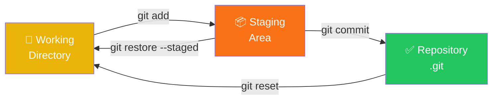
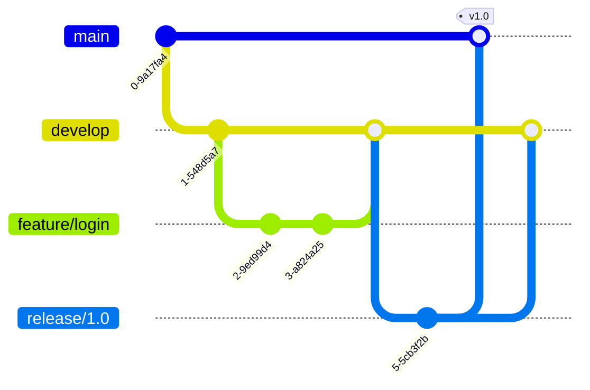
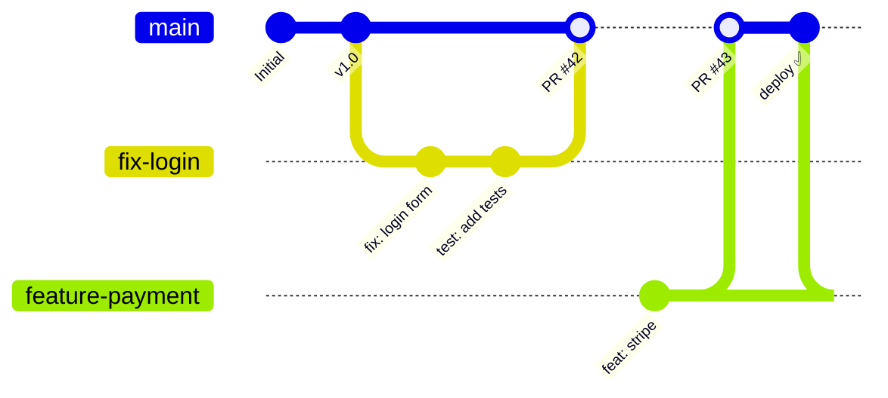
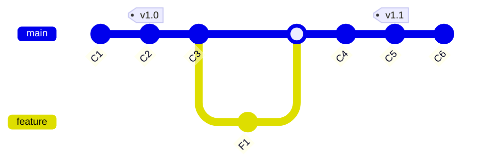
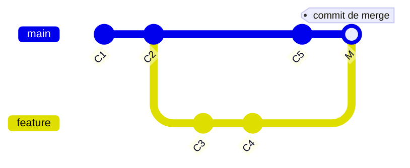
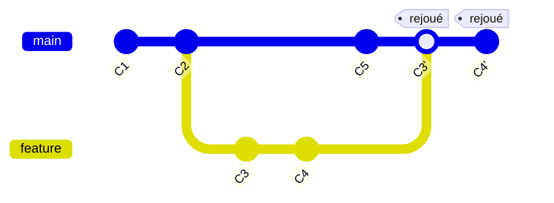

# 🛠️ Git en Action

<div class="mt-12 text-2xl space-y-8">
  
  <v-click>
    <div class="opacity-80">
      Les zones & commandes essentielles 
    </div>
  </v-click>
  
  <v-click>
    <div class="opacity-80">
      Les workflows qui fonctionnent
    </div>
  </v-click>
  
  <v-click>
    <div class="opacity-80">
      Les bonnes pratiques pour collaborer
    </div>
  </v-click>
</div>

<div v-click class="mt-16 text-lg opacity-60">
  De la théorie à la pratique
</div>

<!--
Note orale:
- Transition des concepts vers la pratique
- Annonce des commandes et workflows
- Préparer l'audience à la partie pratique
-->

---
layout: two-cols-header
class: text-center
---

# Les 3 Zones de Git

<h3 class="opacity-80 mb-4">Comprendre où vont vos fichiers</h3>

::left::

<div class="text-left text-sm space-y-2">
  <v-click>
    <div class="p-2 bg-yellow rounded">
      <div class="font-bold text-base mb-1">📝 Working Directory</div>
      <div class="text-xs space-y-0.5">
        <div>• Vos fichiers actuels</div>
        <div>• Modifications non trackées</div>
        <div class="opacity-90 mt-1">
          <code>git status</code> pour voir l'état
        </div>
      </div>
    </div>
  </v-click>
  
  <v-click>
    <div class="p-2 bg-orange rounded">
      <div class="font-bold text-base mb-1">📦 Staging Area (Index)</div>
      <div class="text-xs space-y-0.5">
        <div>• Fichiers prêts à être commités</div>
        <div>• Zone de préparation</div>
        <div class="opacity-90 mt-1">
          <code>git add fichier.txt</code>
        </div>
      </div>
    </div>
  </v-click>
  
  <v-click>
    <div class="p-2 bg-green rounded">
      <div class="font-bold text-base mb-1">✅ Repository (.git)</div>
      <div class="text-xs space-y-0.5">
        <div>• Historique des commits</div>
        <div>• Sauvegarde permanente</div>
        <div class="opacity-90 mt-1">
          <code>git commit -m "message"</code>
        </div>
      </div>
    </div>
  </v-click>
</div>

::right::

<v-click>



</v-click>

<v-click>

<div class="text-xs mt-2 ml-2 p-2 bg-blue rounded text-left">
  <div class="font-bold mb-1">💡 À retenir :</div>
  <div>git add = préparer, git commit = sauvegarder définitivement</div>
</div>

</v-click>

<style>
  .two-cols-header {
    text-align: center;
  }

  .two-cols-header code {
    background: rgba(255,255,255,0.2);
    padding: 1px 4px;
    border-radius: 3px;
    font-size: 0.7em;
  }
  
  .bg-yellow, .bg-orange, .bg-green, .bg-blue {
    color: white;
  }
</style>

<!--
Note orale:
- Working Directory : où vous travaillez
- Staging Area : préparation avant commit
- Repository : historique permanent
- Flux : add puis commit
-->

---
layout: default
---

<div class="demo-compact">

# 💻 Démo : Les 3 Zones en Action

<div class="grid grid-cols-2 gap-3 mt-4">

<div class="space-y-2">

<div v-click class="text-sm font-bold mb-1">1️⃣ État initial</div>

<v-click>

```bash {all|1}
$ git status
On branch main
nothing to commit
```

</v-click>

<div v-click class="text-sm font-bold mb-1">2️⃣ Modification</div>

<v-click>

```bash {all|1|2}
$ echo "Hello Git" > file.txt
$ git status
Changes not staged:
  modified: file.txt
```
</v-click>

<div v-click class="text-xs mt-1 p-1 bg-yellow rounded text-white">
📝 Working Directory modifié
</div>

<div v-click class="text-sm font-bold mb-1">3️⃣ Staging</div>

<v-click>

```bash {all|1|2}
$ git add file.txt
$ git status
Changes to be committed:
  modified: file.txt
```
</v-click>

<div v-click class="text-xs mt-1 p-1 bg-orange rounded text-white">
📦 Staging Area
</div>

</div>

<div class="space-y-2">

<div v-click class="text-sm font-bold mb-1">4️⃣ Commit</div>

<v-click>

```bash {all|1|5}
$ git commit -m "feat: greeting"
[main a1b2c3d] feat: greeting
 1 file changed, 1 insertion(+)
 
$ git status
nothing to commit
```
</v-click>

<div v-click class="text-xs mt-1 p-1 bg-green rounded text-white">
✅ Repository
</div>

<div v-click class="text-sm font-bold mb-1">5️⃣ Historique</div>

<v-click>

```bash {all|1}
$ git log --oneline -3
a1b2c3d feat: greeting
f9e8d7c docs: README
c6b5a4d fix: login bug
```
</v-click>

<div v-click class="mt-2 p-2 bg-blue rounded text-white text-xs">
  <div class="font-bold mb-1">🎯 Cycle complet !</div>
  <div>modif → <code>add</code> → <code>commit</code></div>
</div>

</div>

</div>

</div>

<style>
  .demo-compact h1 {
    font-size: 1.5rem;
    margin-bottom: 0.5rem;
  }
  
  .demo-compact pre {
    font-size: 0.65em !important;
    margin: 0.25rem 0 !important;
    padding: 0.5rem !important;
  }
  
  .bg-yellow, .bg-orange, .bg-green, .bg-blue {
    color: white;
  }
  
  code {
    background: rgba(255,255,255,0.2);
    padding: 1px 3px;
    border-radius: 3px;
    font-size: 0.9em;
  }
</style>

<!--
Note orale:
- DÉMO EN LIVE si possible !
- Montrer concrètement le passage entre les 3 zones
- Insister sur git status à chaque étape
- Montrer que git log permet de voir l'historique
-->

---
layout: two-cols-header
class: text-center
---

# Les Commandes Essentielles

<h3 class="opacity-80 mb-2">Votre boîte à outils quotidienne</h3>

::left::

<div class="text-left text-xs space-y-2">
  <v-click>
    <div>
      <div class="font-bold text-sm text-blue-400">📋 Consulter l'état</div>
      <div class="space-y-1 mt-1">
        <div><code>git status</code> - État actuel</div>
        <div><code>git log </code> - Historique</div>
        <div><code>git diff</code> - Modifications</div>
      </div>
    </div>
  </v-click>
  
  <v-click>
    <div>
      <div class="font-bold text-sm text-green-400">💾 Sauvegarder</div>
      <div class="space-y-1 mt-1">
        <div><code>git add .</code> - Ajouter tous les fichiers</div>
        <div><code>git commit -m "msg"</code> - Commit</div>
        <div><code>git commit --amend</code> - Modifier dernier commit</div>
      </div>
    </div>
  </v-click>
  
  <v-click>
    <div>
      <div class="font-bold text-sm text-purple-400">🌿 Branches</div>
      <div class="space-y-1 mt-1">
        <div><code>git branch</code> - Lister les branches</div>
        <div><code>git branch nom</code> - Créer une branche</div>
        <div><code>git checkout -b nom</code> - Créer + changer</div>
        <div><code>git switch nom</code> - Changer de branche</div>
      </div>
    </div>
  </v-click>
</div>

::right::

<div class="text-left text-xs space-y-2">
  <v-click>
    <div>
      <div class="font-bold text-sm text-orange-400">🔄 Synchroniser</div>
      <div class="space-y-1 mt-1">
        <div><code>git pull</code> - Récupérer + fusionner</div>
        <div><code>git fetch</code> - Récupérer sans fusionner</div>
        <div><code>git push</code> - Envoyer vers remote</div>
        <div><code>git push -u origin branche</code> - 1ère fois</div>
      </div>
    </div>
  </v-click>
  
  <v-click>
    <div>
      <div class="font-bold text-sm text-red-400">🔙 Annuler</div>
      <div class="space-y-1 mt-1">
        <div><code>git restore fichier</code> - Annuler modifs</div>
        <div><code>git restore --staged</code> - Unstage</div>
        <div><code>git reset HEAD~1</code> - Annuler commit</div>
        <div><code>git revert SHA</code> - Revert propre</div>
      </div>
    </div>
  </v-click>
  
  <v-click>
    <div>
      <div class="font-bold text-sm text-teal-400">🔍 Inspecter</div>
      <div class="space-y-1 mt-1">
        <div><code>git show SHA</code> - Détails d'un commit</div>
        <div><code>git blame fichier</code> - Qui a modifié ?</div>
        <div><code>git log --graph</code> - Visualiser l'arbre</div>
      </div>
    </div>
  </v-click>
</div>

<style>
  .two-cols-header code {
    background: rgba(255,255,255,0.1);
    padding: 2px 6px;
    border-radius: 3px;
    font-size: 0.85em;
  }
</style>

<!--
Note orale:
- Ces commandes couvrent 90% de l'utilisation quotidienne
- Commencer par status, add, commit, push
- Les autres viennent avec la pratique
-->

---
layout: two-cols-header
class: text-center
---

# Git Flow : Le Workflow Classique

<h3 class="opacity-80 mb-2">Branches structurées pour projets complexes</h3>

::left::

<div class="text-left text-xs space-y-2">
  <v-click>
    <div class="p-2 bg-blue rounded">
      <div class="font-bold text-sm mb-1">🌟 main (production)</div>
      <div>Code en production, toujours stable</div>
    </div>
  </v-click>
  
  <v-click>
    <div class="p-2 bg-teal rounded">
      <div class="font-bold text-sm mb-1">🚧 develop (intégration)</div>
      <div>Branche de développement principal</div>
    </div>
  </v-click>
  
  <v-click>
    <div class="p-2 bg-green rounded">
      <div class="font-bold text-sm mb-1">✨ feature/* (fonctionnalités)</div>
      <div>feature/login, feature/payment</div>
      <div class="opacity-80 mt-1">Depuis develop → vers develop</div>
    </div>
  </v-click>
  
  <v-click>
    <div class="p-2 bg-yellow rounded">
      <div class="font-bold text-sm mb-1">🔧 release/* (versions)</div>
      <div>release/1.2.0</div>
      <div class="opacity-80 mt-1">Depuis develop → vers main + develop</div>
    </div>
  </v-click>
  
  <v-click>
    <div class="p-2 bg-red rounded">
      <div class="font-bold text-sm mb-1">🚨 hotfix/* (correctifs)</div>
      <div>hotfix/security-patch</div>
      <div class="opacity-80 mt-1">Depuis main → vers main + develop</div>
    </div>
  </v-click>
</div>

::right::

<v-click>



</v-click>

<v-click>

<div class="text-xs mt-2 ml-2 p-2 bg-gray rounded text-left">
  <div class="font-bold mb-1">📝 Quand utiliser Git Flow ?</div>
  <div>Projets avec releases planifiées, versions multiples en production, équipes grandes</div>
</div>

</v-click>

<style>
  .two-cols-header {
    text-align: center;
  }
  
  .bg-blue, .bg-teal, .bg-green, .bg-yellow, .bg-red, .bg-gray {
    color: white;
  }
</style>

<!--
Note orale:
- Git Flow : structure complète avec 5 types de branches
- Idéal pour releases planifiées
- Peut être trop complexe pour petites équipes
-->

---
layout: two-cols-header
class: text-center
---

# GitHub Flow : Simple et Efficace

<h3 class="opacity-80 mb-4">Le workflow moderne pour le déploiement continu</h3>

::left::

<div class="text-left text-sm space-y-3">
  <v-click>
    <div>
      <div class="font-bold text-lg text-green-400">1️⃣ Une seule branche principale</div>
      <div class="text-xs mt-1">
        <code>main</code> est toujours déployable / déployer
      </div>
    </div>
  </v-click>
  
  <v-click>
    <div>
      <div class="font-bold text-lg text-blue-400">2️⃣ Créer une branche descriptive</div>
      <div class="text-xs mt-1">
        <code>git checkout -b fix-login-bug</code>
      </div>
    </div>
  </v-click>
  
  <v-click>
    <div>
      <div class="font-bold text-lg text-purple-400">3️⃣ Commits réguliers</div>
      <div class="text-xs mt-1">
        Commitez souvent, pushez régulièrement
      </div>
    </div>
  </v-click>
  
  <v-click>
    <div>
      <div class="font-bold text-lg text-orange-400">4️⃣ Ouvrir une Pull Request</div>
      <div class="text-xs mt-1">
        Demander une review dès que possible
      </div>
    </div>
  </v-click>
  
  <v-click>
    <div>
      <div class="font-bold text-lg text-teal-400">5️⃣ Review + Tests</div>
      <div class="text-xs mt-1">
        Discussion, CI/CD, approbation
      </div>
    </div>
  </v-click>
  
  <v-click>
    <div>
      <div class="font-bold text-lg text-green-400">6️⃣ Merge vers main</div>
      <div class="text-xs mt-1">
        Déploiement automatique
      </div>
    </div>
  </v-click>
</div>

::right::

<v-click>



</v-click>

<v-click>

<div class="text-xs mt-2 p-2 bg-green rounded text-left">
  <div class="font-bold mb-1">✅ Avantages</div>
  <div>Simple, rapide, parfait pour le déploiement continu et les équipes agiles et séniors</div>
</div>

</v-click>

<style>
  .two-cols-header {
    text-align: center;
  }
  
  .two-cols-header code {
    background: rgba(255,255,255,0.1);
    padding: 2px 4px;
    border-radius: 3px;
    font-size: 0.8em;
  }
  
  .bg-green {
    color: white;
  }
</style>

<!--
Note orale:
- GitHub Flow : ultra simple, une seule branche principale
- Workflow moderne, idéal pour le déploiement continu
- Utilisé par GitHub, beaucoup de startups
- Pull Requests au centre du processus
-->

---
layout: center
class: text-center
---

# 🚀 Trunk-Based Development

<h3 class="opacity-80 mb-8">Le workflow de la vitesse et de l'agilité</h3>

<div class="grid grid-cols-2 gap-8 text-left">

<div>

<v-click>

**🎯 Principe**

<div class="text-sm mt-3 space-y-2">
  <div>• Une seule branche : <code>main</code> (trunk)</div>
  <div>• Commits directs ou branches ultra-courtes</div>
  <div>• Feature flags pour cacher le WIP</div>
  <div>• Intégration continue maximale</div>
</div>

</v-click>

<v-click>

<div class="mt-6 p-3 bg-green rounded text-white text-sm">
  <div class="font-bold mb-2">✅ Avantages</div>
  <div class="text-xs space-y-1">
    <div>• Intégration continue réelle</div>
    <div>• Conflits détectés tôt</div>
    <div>• Cycle de release rapide</div>
    <div>• Simplicité extrême</div>
  </div>
</div>

</v-click>

</div>

<div>

<v-click>



<div class="text-xs mt-3 text-center opacity-80">
Branches de feature très courtes (heures, max 1-2 jours)
</div>

</v-click>

<v-click>

<div class="mt-4 p-3 bg-red rounded text-white text-sm">
  <div class="font-bold mb-2">⚠️ Inconvénients</div>
  <div class="text-xs space-y-1">
    <div>• Nécessite feature flags</div>
    <div>• Tests automatisés essentiels</div>
    <div>• Discipline d'équipe requise</div>
    <div>• CI/CD obligatoire</div>
  </div>
</div>

</v-click>

</div>

</div>

<v-click>

<div class="mt-2 p-4 bg-blue rounded text-white">
  <div class="font-bold text-lg mb-2">🏢 Qui utilise ?</div>
  <div class="text-sm">
    Google, Facebook, Netflix, Amazon... Entreprises avec déploiement continu
  </div>
</div>

</v-click>

<style>
  .bg-green {
    background: #10b981;
  }
  
  .bg-red {
    background: #ef4444;
  }
  
  .bg-blue {
    background: #3b82f6;
  }
  
  code {
    background: rgba(255,255,255,0.2);
    padding: 2px 6px;
    border-radius: 3px;
  }
</style>

<!--
Note orale:
- Trunk-Based : philosophie "intégrer tôt, intégrer souvent"
- Nécessite maturité : tests auto, CI/CD, feature flags
- Branches courtes = moins de conflits, meilleure collaboration
- Utilisé par les GAFAM pour déployer plusieurs fois par jour
-->

---
layout: two-cols-header
class: text-center
---

# Merge vs Rebase

<h3 class="opacity-80 mb-4">Deux philosophies d'intégration</h3>

::left::

<div v-click > 🔀 Git Merge </div>

<v-click>


</v-click>

<div class="text-sm mt-3 space-y-2">
  <div v-click class="font-bold text-green">✅ Avantages</div>
  <div class="text-xs space-y-1 ml-2">
    <div v-click>• Historique vrai et complet</div>
    <div v-click>• Trace de quand/comment</div>
    <div v-click>• Commits originaux préservés</div>
  </div>
  <div v-click class="font-bold text-red mt-2">❌ Inconvénients</div>
  <div class="text-xs space-y-1 ml-2">
    <div v-click >• Historique complexe</div>
    <div v-click >• Commits de merge "pollution"</div>
  </div>
</div>


::right::
<div v-click> 📐 Git Rebase </div>
<v-click>


</v-click>

<div class="text-sm mt-3 space-y-2">
  <div v-click class="font-bold text-green">✅ Avantages</div>
  <div class="text-xs space-y-1 ml-2">
    <div v-click>• Historique linéaire et lisible</div>
    <div v-click>• Pas de commits de merge</div>
    <div v-click>• Plus facile à comprendre</div>
  </div>
  <div v-click class="font-bold text-red mt-2">❌ Inconvénients</div>
  <div class="text-xs space-y-1 ml-2">
    <div v-click>• Perd le contexte temporel</div>
    <div v-click>• Réécrit l'historique (nouveaux SHA)</div>
  </div>
</div>

<style>
  .text-green {
    color: #10b981;
  }
  
  .text-red {
    color: #ef4444;
  }
  
  .bg-blue {
    background: #3b82f6;
  }
  
  code {
    background: rgba(255,255,255,0.2);
    padding: 2px 6px;
    border-radius: 3px;
  }
</style>

<!--
Note orale:
- Merge : philosophie "l'historique est sacré, on garde tout"
- Rebase : philosophie "l'historique doit être lisible"
- Pas de bonne/mauvaise réponse : c'est un choix d'équipe
- Attention : rebase change les SHA donc coordonner avec l'équipe si branche partagée
-->

---
layout: default
class: text-center
---

# Les Bonnes Pratiques

<div class="grid grid-cols-2 gap-4 text-left mt-6">

<div>

<v-click>

<div class="p-2 bg-blue rounded mb-2">
  <div class="font-bold text-sm mb-1">✍️ Les commits</div>
  <div class="text-xs space-y-1">
    <div>✅ <strong>Atomiques</strong> : 1 idée = 1 commit</div>
    <div>✅ <strong>Messages clairs</strong> : pas de "fix"</div>
    <div>✅ <strong>Commiter souvent</strong></div>
  </div>
</div>

</v-click>

<v-click>

<div class="p-2 bg-green rounded">
  <div class="font-bold text-sm mb-1">💡 Conventional Commits</div>
  <div class="text-xs space-y-0.5">
    <div><code>feat:</code> nouvelle fonctionnalité</div>
    <div><code>fix:</code> correction de bug</div>
    <div><code>test:</code> ajout de tests</div>
    <div><code>chore:</code> tâches diverses</div>
  </div>
  <div class="text-xs mt-2 opacity-80">
    Standard de l'industrie, compatible avec semantic versioning<br/>
    <a href="https://www.conventionalcommits.org" target="_blank" class="underline">
      📚 conventionalcommits.org
    </a>
  </div>
</div>

</v-click>

</div>

<div>

<v-click>

<div class="p-2 bg-red rounded mb-2">
  <div class="font-bold text-sm mb-1">🚫 À éviter absolument</div>
  <div class="text-xs space-y-1">
    <div>❌ Commiter des <strong>secrets/passwords</strong></div>
    <div>❌ <strong>Commits géants</strong> : impossible à review</div>
    <div>❌ <strong>Force push</strong> sans prévenir l'équipe</div>
  </div>
  <div class="text-xs mt-2 opacity-80">
    Ces erreurs impactent toute l'équipe
  </div>
</div>

</v-click>


<v-click>

<div class="p-2 bg-purple rounded mb-2">
  <div class="font-bold text-sm mb-1">🔄 Collaboration</div>
  <div class="text-xs space-y-1">
    <div>✅ <strong>Pull avant push</strong></div>
    <div>✅ <strong>Code review</strong> : PR ou direct</div>
  </div>
</div>

</v-click>

<v-click>

<div class="p-2 bg-purple rounded">
  <div class="font-bold text-sm mb-1">🐕 Husky + AGENTS.md</div>
  <div class="text-xs">
    Git hooks : <code>commitlint</code> + <code>lint-staged</code><br/>
    💡 Documente pour l'IA !
  </div>
</div>

</v-click>

</div>

</div>

<v-click>

<div class="mt-3 p-2 bg-orange rounded text-white text-center">
  <div class="text-xs">
    💡 <strong>Règle d'or</strong> : Adaptez ces pratiques à votre workflow (Git Flow, GitHub Flow, Trunk-Based...), votre context et votre équipe 
  </div>
</div>

</v-click>

<style>
  .bg-green, .bg-red, .bg-blue, .bg-purple, .bg-orange {
    color: white;
  }
  
  .bg-purple {
    background: #a855f7;
  }
  
  .bg-orange {
    background: #f97316;
  }
  
  code {
    background: rgba(255,255,255,0.2);
    padding: 2px 6px;
    border-radius: 3px;
  }
</style>

<!--
Note orale:
- Pratiques universelles : commits atomiques, messages clairs
- S'adapter au contexte : Trunk-Based permet commits directs sur main
- L'important : cohérence d'équipe, pas de dogme
- Conventional Commits : facilite changelogs automatiques
- Husky : automatise validation (commitlint + lint-staged)
- IMPORTANT : Documente tes conventions dans AGENTS.md pour que l'IA les respecte !
-->

---
layout: center
class: text-center
---

# 🎯 L'essentiel à retenir

<div class="grid grid-cols-3 gap-3 mt-6 text-left">
  
<v-click>

<div class="p-2 bg-purple rounded">
  <div class="font-bold text-sm mb-2">🔧 Commandes essentielles</div>
  <div class="text-xs space-y-1">
    <div>• <code>status</code>, <code>add</code>, <code>commit</code></div>
    <div>• <code>pull</code>, <code>push</code></div>
    <div>• <code>branch</code>, <code>checkout</code></div>
    <div>• <code>stash</code>, <code>log</code></div>
  </div>
</div>

</v-click>
  
<v-click>

<div class="p-2 bg-teal rounded">
  <div class="font-bold text-sm mb-2">🌿 Workflows</div>
  <div class="text-xs space-y-1">
    <div>• <strong>Git Flow</strong> : releases planifiées</div>
    <div>• <strong>GitHub Flow</strong> : simple, agile</div>
    <div>• <strong>Trunk-Based</strong> : vitesse max</div>
    <div class="opacity-80 mt-1">→ Adapter à son contexte</div>
  </div>
</div>

</v-click>
  
<v-click>

<div class="p-2 bg-blue rounded">
  <div class="font-bold text-sm mb-2">🔀 Intégration</div>
  <div class="text-xs space-y-1">
    <div>• <strong>Merge</strong> : historique complet</div>
    <div>• <strong>Rebase</strong> : historique linéaire</div>
    <div class="opacity-80 mt-1">→ Deux philosophies valides</div>
  </div>
</div>

</v-click>

</div>

<div class="grid grid-cols-2 gap-3 mt-3 text-left">

<v-click>

<div class="p-2 bg-green rounded">
  <div class="font-bold text-sm mb-2">✅ Pratiques universelles</div>
  <div class="text-xs space-y-1">
    <div>• Commits atomiques</div>
    <div>• Conventional Commits (<code>feat:</code>, <code>fix:</code>)</div>
    <div>• Code review systématique</div>
    <div>• Husky pour automatiser</div>
  </div>
</div>

</v-click>

<v-click>

<div class="p-2 bg-orange rounded">
  <div class="font-bold text-sm mb-2">🚫 À ne jamais faire</div>
  <div class="text-xs space-y-1">
    <div>• Commiter des secrets</div>
    <div>• Commits géants</div>
    <div>• Force push sans communication</div>
  </div>
</div>

</v-click>

</div>

<v-click>

<div class="mt-6 p-3 bg-gradient rounded text-center">
  <div class="text-lg font-bold">💡 Git est un outil, pas un dogme</div>
  <div class="text-sm mt-2 opacity-90">
    Adaptez-le à votre équipe, votre projet, votre contexte
  </div>
  <div class="text-xl mt-3">
    🚀 La pratique rend parfait !
  </div>
</div>

</v-click>

<style>
  .bg-purple, .bg-teal, .bg-blue, .bg-green, .bg-orange {
    color: white;
  }
  
  .bg-gradient {
    background: linear-gradient(135deg, #667eea 0%, #764ba2 100%);
    color: white;
  }
  
  code {
    background: rgba(255,255,255,0.2);
    padding: 1px 4px;
    border-radius: 3px;
    font-size: 0.9em;
  }
</style>

<!--
Note orale:
- Recap complet : commandes, workflows, intégration, pratiques
- Message final : pas de dogme, s'adapter
- Encourager la pratique et l'expérimentation
- Git est puissant mais il faut du temps pour maîtriser
-->

